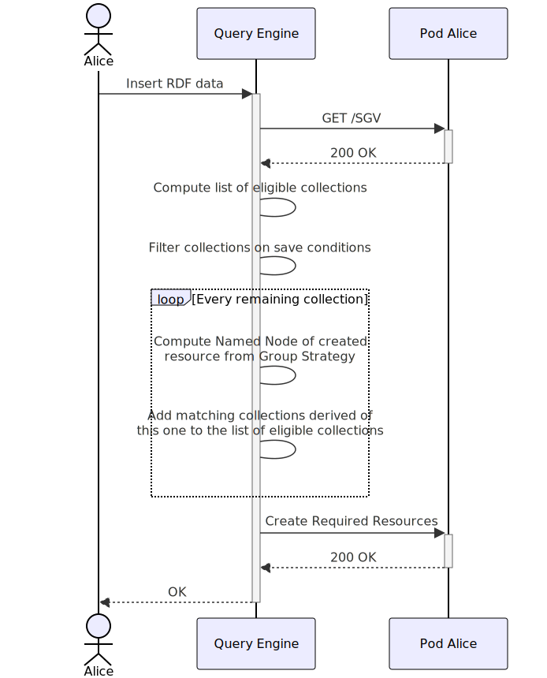
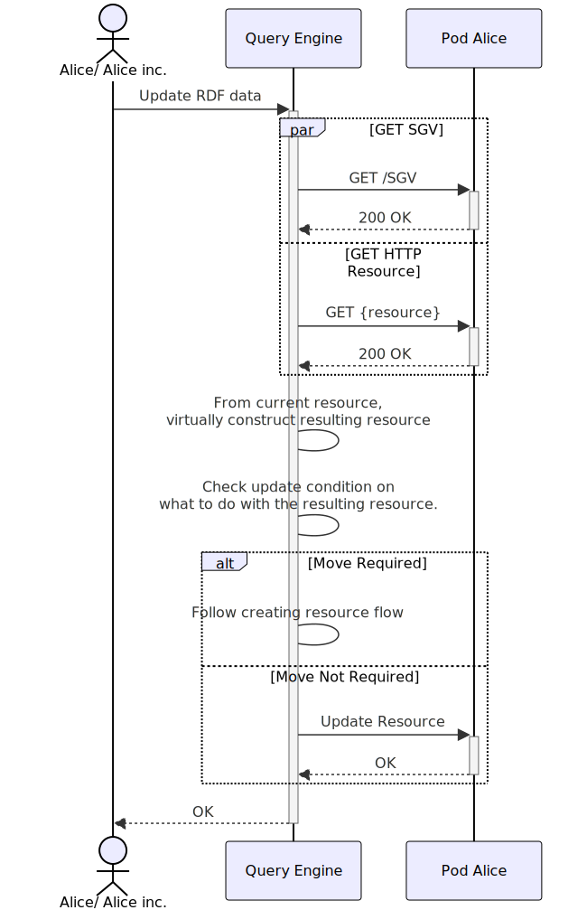
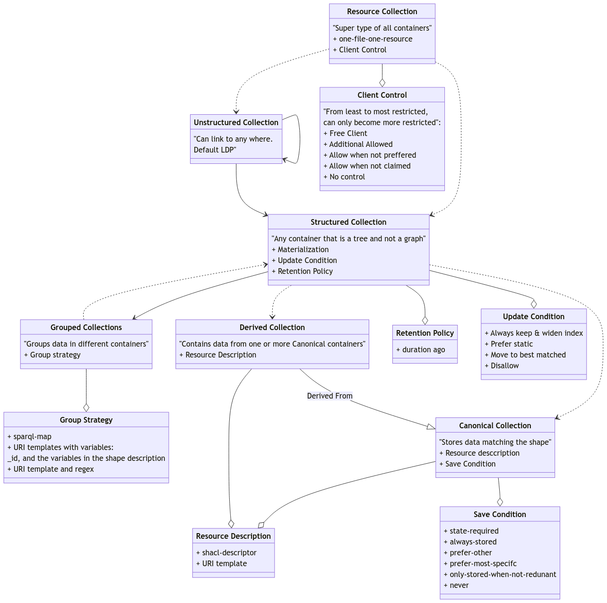

## Storage Guidance Vocabulary
{:#sgv}

To empower automated clients to correctly store resources, we suggest the usage of a descriptive vocabulary.
Existing structure definitions of data spaces like Type Index and Shape Trees focus on read queries and insufficiently support write queries.
These structure definitions fail to express the underlying decision-making of why a resource is stored where it is. 

We therefore introduce a new vocabulary, the Storage Guidance Vocabulary (SGV).
This vocabulary takes inspiration from the Shape Tree Specification, but does not extend it.
The vocabulary aims to express where and why a resource is stored in a location.
SGV is created with a primary focus on LDP interfaces.
We suggest an interface where LDP containers can be structured.
A container marked as structured has a strict definition of where containing containers/resources are located.
We shortly introduce some basic concepts in SGV:  
**Resource Collection**: Corresponds to an LDP container.  
**Structured Collection**: A canonical or derived collection.  
**Canonical Collection**: A resource collection containing resources.   
**Derived Collection** A resource collection that stores resources already stored by one or more other structured containers.  
**Resource Description**: A way of describing resources, for example through ShEx or SHACL.   
**Group Strategy**: A description of how resources should be grouped together, for example: my images have are grouped per creation date.  
**Save Condition**: When multiple collections are eligible to save a resource, the save condition decides what collection(s) actually save the resource.  
**Update Condition**: Describes what to do when a containing resource is changed.  
**Client Control**: Describes the amount of freedom a client has when trying to save a resource.  

### Flow

#### A client wants to create an RDF-resource:
{:#flow-create-rdf-resource}

Inserts happen on a pod level, meaning you just specify to the client what pod you'd want to insert a resource to.

1. The client gets the SGV description of the storage space (can be cached).
2. The client checks all canonical resources and checks if the resource to be inserted matches the resource description of the collection.
3. If the resource matches the description, the client checks the save condition of the collection given the eligible collections.
4. For each collection that is saves the resource:
   1. The client checks the group strategy of the collection and groups the resource accordingly, deciding on the name of the new resource.
   2. The client checks the collections that are derived from this collection.  
        Step 4. is executed for all collections that are derived from this collection, and the resource matches the description. 
5. The client performs the save operation.

<figure id="rdf-create">

<figcaption markdown="block">
Flow: create RDF resource
</figcaption>
</figure>

#### A client wants to update an RDF-resource:

An update can be both an insert to an existing resource, a change in values of a resource, or a deletion the whole, or part of a resource.
In case of an update, it's important that the client knows what resource will be updated.
This is similar to how queries are executed right now where you should always specify the web resource to query over (excluding link-traversal clients).

1. The client gets the SGV description of the storage space and the HTTP resource containing the updated RDF resource.
2. The client virtually construct the resource that would result from the requested operation.
3. The client check the update condition of the collection the resource currently resides in. Following action depend on the update condition.
    Typically, the update-condition will say whether an RDF-resource is moved or not.
    1. Move required: follow the steps described in .
    2. No move required: just update the resource as requested by the user.

<figure id="rdf-update">

<figcaption markdown="block">
Flow: update RDF resource
</figcaption>
</figure>

### Details

We will now give an in depth explanation of the different components of SGV.

<figure id="sgv-vocab-overview">

<figcaption markdown="block">
Visualisation of the Storage Guidance Vocabulary
</figcaption>
</figure>

### Pitfalls of Shape Trees
text
