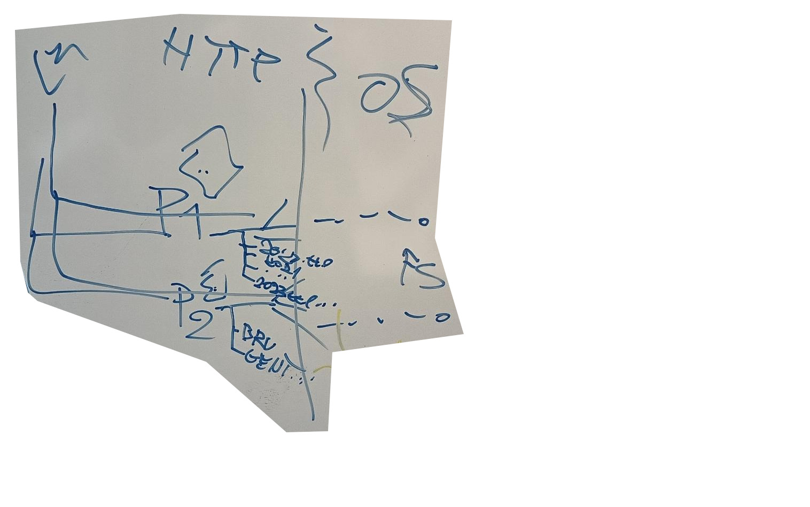
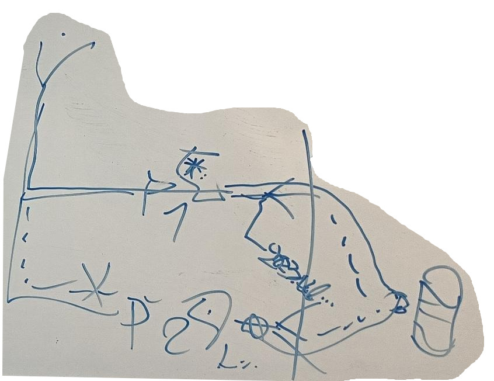
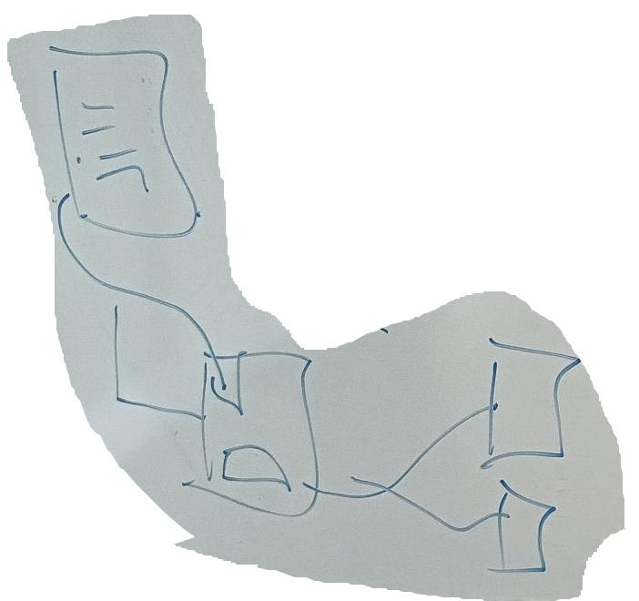

## Going into the meeting

In our [user stories](../user-stories/index.md) we discussed LDP to not be a well suited technology.
However, LDP is unlikely to disappear from the specification, and thus our solution should also work with it.

* Access control: ACP is all we need
* Data discovery: shape trees are the new indices, according to the solid spec, but it is weird that the spec is offline.
* Storage: I like TREE better since it allows different views to be made,
  but LDP also suffices since a resource need not be in a unique container.
* You could have a list of newly acquired resources, and each application can decide whether they want to link to it?
* There exist languages that have the notion of "location"/ focus node,
  but we think those break the Access path dependence requirement.

There would be two ways of thinking about an insert
1. I have a resource, where should I place it, and how should I change the indices?
2. I have a resource, I store it in the pod,
   what resources should link to my new resources, and how should I change the indices?

The second option allows us to think independently of the resource hierarchy specification.
Specifications like Shape trees have the same kind of limitations stating:
> While shape trees are intended to adapt to different technology platforms
that support the notion of containers and resources, examples in this
specification will reflect usage in an LDP environment.

Having the specification work without many requirements on other specifications allows for a broader implementation.
For example, asking question two could even be used in extracting views in the TREE/ LDES specifications.

Going forward: I think constructing a way to specify how a resource should link to new resources might be interesting.
Sort of like the subscription model that exists for LDNChannel2023, but automated?

## During the meeting

You cannot just say "I link to something" because a resource does not always have to be the whole file.
That's what LDP still allows easily; you can have multiple resources contained within one file.

A solution would describe whether a storage location/ container is, for example:
1. canonical
2. derived
3. only-stored-when-not-redundant
4. always stored
5. other?

And the different storage locations could be seen as special cases of each-other.
The Broadest way of storage would be LDP:

A SPARQL endpoint could be seen as a special case of LDP where
each resource has their own file and hard- /soft-links are always used.

Going further, LDES could be seen as an alternative where the client just stores in a certain location.
The server uses the technology that would otherwise be used by the clint in the case of LDP and SPARQL endpoint.

Read: [What's in a Pod?–A knowledge graph interpretation for the Solid ecosystem](https://imec-publications.be/bitstream/handle/20.500.12860/40806/DS582.pdf?sequence=1) 

## Conclusions

Next, we should think about an ontology/ description of the different ways
we want to guide a client into making the correct decisions as to where we would store data.

