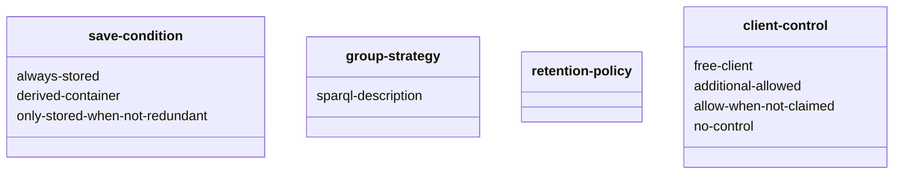

After the [meeting of 21 november 2023](../../meetings/meeting_ruben_taelman_21_11_2023.md)
we can start writing an ontology that guides automated clients in performing updates as instructed by pod owners.

## Reusing existing ontologies
When writing a new ontology, it is important to use existing ontologies as much as possible,
or express the relation of your ontology to existing ones as much as possible.

We can use most parts of [shape trees](https://jitsedesmet.github.io/shape-trees-spec/).

### Retention Policy
A user can define [LDES](https://semiceu.github.io/LinkedDataEventStreams/#retention)
inspired retention policy and warn writers of event streams, for example,
that they should regularly aggregate their stream data.
This could work just like a garbage collector.
Based on a certain time attribute, a garbage collector cleans event streaming data. 


## Adding new components
### Do we save? (`sgo:save-condition`)
#### sgo:always-stored/ sgo:canonicalContainer
Just stores the data in case the description matches.

#### sgo:derived-container
A derived container can use soft links in specific LDP cases.
It could also describe a construct query in the case of SPARQL endpoints.


#### sgo:only-stored-when-not-redundant
Stores only when no one else stores it, a dedicated container could be set up instead of falling back to an exception.

### Resource Description:
Shape description needs to be able to say both
  1. picture contains son or daughter
  2. picture contains son and daughter

### Container Description `sgo:group-strategy`
#### sgo:groupsBy ?GroupDescription
`?GroupDescription` should be a SPARQL select query over the resources in the scoped collection returning `?key` and `?value`
The key is the resource identifier, the value an `xsd:string` representing the directory name.
For this allows for complex splits like: `rome-23-07-2023`?

Maybe this poses a security issue (execution of queries), and we should also add a description?


#### LDES inspired retention policy `sgo:retention-policy`
https://semiceu.github.io/LinkedDataEventStreams/#retention


### What if no preference matches the new resource?
#### Notification


#### Assume


#### Deny

### Client control
#### `sgo:free-client`
Client is free to do what they desire

#### `sgo:additional-allowed`
Additional replications are allowed.

#### `sgo:allow-when-not-claimed`
The client can decide where to store something if no one else wants it

#### `sgo:no-control`
The client is not allowed to express any opinion.


### ACID
We probably need some more complex sync system for this?

### VARIA
#### sgo:resourceSeperated
Describes that each resource has its own file and no multiple resources reside in one file.
This essentially means that resources in this container are free of
[fragments](https://developer.mozilla.org/en-US/docs/Web/HTTP/Basics_of_HTTP/Identifying_resources_on_the_Web#fragment)

## Visual representation



## Shape:
```turtle
@prefix ex: <http://example.org/> .
@prefix sh: <http://www.w3.org/ns/shacl#> .
@prefix rdf: <http://www.w3.org/1999/02/22-rdf-syntax-ns#> .
@prefix rdfs: <http://www.w3.org/2000/01/rdf-schema#> .
@prefix xsd: <http://www.w3.org/2001/XMLSchema#> .
@prefix sgo: <http://www.storage-guidance-ontology.com/>.

sgo:main-shape
    a sh:NodeShape;
    sh:property [
       sh:path ldbc:firstName ;
       sh:minCount 1 ;
       sh:maxCount 1 ;
       sh:datatype xsd:string ;
       sh:name "Given Name" ;
    ] ;
.
```


### Shape descriptions
We decide that the update guidance is not part of the resource for now.
The storage guidance system depends on shape-trees to define itself.

Let's start by adding on the
[physical example of shape trees](https://jitsedesmet.github.io/shape-trees-spec/#shapetree-physical)
working on top of LDP.
```turtle
@prefix ex: <http://example.org/> .
PREFIX st: <http://www.w3.org/ns/shapetrees#>.
PREFIX rdfs: <http://www.w3.org/2000/01/rdf-schema#>.
PREFIX ex: <http://www.example.com/ns/ex#>.
PREFIX sgo: <http://www.storage-guidance-ontology.com/>.

<> st:describedBy ex:project-en, ex:project-es, ex:project-nl, ex:project-ko .

<#ProjectTree>
  a st:ShapeTree ;
  st:expectsType st:Container ;
  st:shape ex:ProjectShape;
  sgo:groupByEqualObject ex:project-name; 
  st:contains <#MilestoneTree> .

<#MilestoneTree>
  a st:ShapeTree ;
  st:expectsType st:Container ;
  st:shape ex:MilestoneShape ;
  st:contains <#TaskTree>, <#IssueTree> .

<#TaskTree>
  a st:ShapeTree ;
  st:expectsType st:Container ;
  st:shape ex:TaskShape ;
  st:contains st:NonRDFResourceTree .

<#IssueTree>
  a st:ShapeTree ;
  st:expectsType st:Container ;
  st:shape ex:IssueShape ;
  st:contains st:NonRDFResourceTree .
```


## Ontology Evaluation
In this section,
we evaluate an automated client that uses ACP and our ontology guidance system to the user stories for each storage mechanism.
The ontology we created could work on different storage mechanisms with different effectiveness.
We do not consider data-discovery mechanism as this is actively being researched by query experts,
and we believe an index should provide update mechanism themselves.
In future research, it might be beneficial to also consider updating the index as part of the update query. 
We further assume the use of SPARQL as it allows users to enter broad queries that are in line with our
[data dependence requirements](../../user-stories/stories.md). 

* [LDP](LDP-evaluation.md)
* [SPARQL endpoint](SPARQL-endpoint-evaluation.md)
* [LDES](LDES-evaluation.md)
